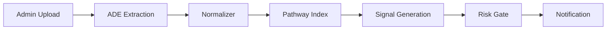

# 📈 Earnings Copilot HFT

[](https://python.org)
[](https://fastapi.tiangolo.com)
[](https://reactjs.org)
[](https://www.typescriptlang.org)
[](https://landing.ai)

> AI-powered earnings analysis and trading signals with real-time notifications and LandingAI ADE integration

## Overview

**Earnings Copilot HFT** is an automated financial analysis system that processes earnings documents, extracts key performance indicators (KPIs), and generates actionable trading signals with real-time notifications. The system combines document AI, live data indexing, and compliance monitoring to provide instant investment insights.

### Key Features

- 🤖 **AI Document Processing**: LandingAI ADE (DPT-2) extracts KPIs from earnings reports
- 📊 **Live Data Pipeline**: Pathway hybrid search (BM25 + vectors) for real-time indexing
- ⚡ **Real-time Processing**: Pathway framework for streaming data analytics (macOS/Linux)
- 🔔 **Real-time Notifications**: SSE-based alerts for new documents, signals, and compliance
- ⚖️ **Risk Management**: Confidence gating and compliance rule enforcement
- 📄 **Investment Memos**: Automated PDF report generation with citations
- 🎯 **Trading Signals**: BUY/SELL/HOLD recommendations with confidence scores
- 📊 **Real-time Signal Chart**: Multi-ticker signal strength visualization with interactive markers

## Architecture

```
┌─────────────────┐    ┌──────────────────┐    ┌─────────────────┐
│   Admin Upload  │───▶│  ADE Extraction  │───▶│   Normalizer    │
│   (PDF Files)   │    │    (DPT-2)       │    │  & Validation   │
└─────────────────┘    └──────────────────┘    └─────────────────┘
                                                          │
┌─────────────────┐    ┌──────────────────┐    ┌─────────────────┐
│   Streamlit UI  │◀───│  FastAPI Server  │◀───│  Pathway Live   │
│  (Admin/Trader) │    │   (REST + SSE)   │    │     Index       │
└─────────────────┘    └──────────────────┘    └─────────────────┘
                                │                         │
                                ▼                         ▼
                       ┌──────────────────┐    ┌─────────────────┐
                       │  Signal Agent +  │    │  Compliance     │
                       │   Risk Gate      │    │     Agent       │
                       └──────────────────┘    └─────────────────┘
```

## Quick Start

### Prerequisites
- Python 3.11+
- Node.js 18+
- LandingAI API Key (for document extraction)
- **Pathway Framework**: Only available on macOS and Linux (Windows uses enhanced mock)

### 1. Setup Environment

```bash
# Clone and navigate to project
git clone <repository-url>
cd earnings-copilot-hft

# Install dependencies
pip install -r requirements.txt

# Copy environment file
cp env.example .env

# Edit .env with your API keys
```

### 2. Initialize Database

```bash
make init-db
```

### 3. Start Services

```bash
# Terminal 1: Start API server
make run-api

# Terminal 2: Start UI
make run-ui
```

### 4. Access Applications

- **API Documentation**: http://localhost:8000/docs
- **Streamlit UI**: http://localhost:8501
- **Health Check**: http://localhost:8000/health

## API Reference

### Authentication

All endpoints require an `X-API-Key` header:

- **Admin Key**: `admin-secret` (for document uploads)
- **Trader Key**: `trader-secret` (for signals and subscriptions)

### Core Endpoints

#### Admin Operations

```bash
# Upload earnings document
curl -H "X-API-Key: admin-secret" \
     -F "file=@data/samples/aapl_10q.pdf" \
     -F "ticker=AAPL" \
     -F "period=2025-Q3" \
     -F "doc_type=earnings" \
     http://localhost:8000/admin/ingest

# Upload compliance document
curl -H "X-API-Key: admin-secret" \
     -F "file=@compliance_margins.pdf" \
     -F "ticker=AAPL" \
     -F "doc_type=compliance" \
     -F "effective_date=2025-12-01" \
     http://localhost:8000/admin/ingest
```

#### Subscription Management

```bash
# Subscribe to AAPL notifications
curl -H "X-API-Key: trader-secret" \
     -H "Content-Type: application/json" \
     -d '{"ticker":"AAPL","channels":["ws","slack"]}' \
     http://localhost:8000/subscriptions

# List subscriptions
curl -H "X-API-Key: trader-secret" \
     http://localhost:8000/subscriptions

# Unsubscribe from AAPL
curl -X DELETE -H "X-API-Key: trader-secret" \
     http://localhost:8000/subscriptions/AAPL
```

#### Trading Signals & Data

```bash
# Get trading signal
curl -H "X-API-Key: trader-secret" \
     "http://localhost:8000/signal?ticker=AAPL&period=2025-Q3"

# Get KPI data
curl -H "X-API-Key: trader-secret" \
     "http://localhost:8000/kpi?ticker=AAPL&metric=revenue&period=2025-Q3"

# Search documents
curl -H "X-API-Key: trader-secret" \
     "http://localhost:8000/search?q=revenue+growth&limit=10"

# Export investment memo
curl -H "X-API-Key: trader-secret" \
     "http://localhost:8000/export/memo?ticker=AAPL&period=2025-Q3&format=pdf" \
     -o memo.pdf
```

#### Real-time Events (SSE)

```bash
# Connect to event stream
curl -H "X-API-Key: trader-secret" \
     "http://localhost:8000/events/stream?user_id=trader_user"
```

**Event Types:**
- `NEW_DOC_INGESTED`: Document uploaded and processed
- `NEW_SIGNAL_READY`: Trading signal generated
- `COMPLIANCE_ALERT`: Margin requirement changes

## Data Flow

### 1. Document Ingestion



**Process:**
1. Admin uploads PDF via `/admin/ingest`
2. ADE extracts financial data with provenance
3. Normalizer validates and enriches with consensus
4. Pathway indexes data for search and retrieval
5. Signal agent generates BUY/SELL/HOLD recommendation
6. Risk gate applies confidence and compliance checks
7. SSE notifications sent to subscribers

### 2. Signal Generation Logic

**Factors Weighted:**
- **EPS Surprise** (40%): Actual vs consensus earnings
- **Revenue Surprise** (30%): Revenue beat/miss
- **Margin Changes** (20%): Profitability trends
- **Other Metrics** (10%): Additional KPIs

**Actions:**
- **BUY**: Score ≥ 0.3 (positive surprises, improving margins)
- **SELL**: Score ≤ -0.3 (negative surprises, declining margins)  
- **HOLD**: -0.3 < Score < 0.3 (mixed or neutral signals)

### 3. Risk Management

**Confidence Gates:**
- Minimum 70% confidence required
- Data quality checks (max 20% needs review)
- Compliance rule validation

**Compliance Monitoring:**
- Margin requirement changes
- Exposure guidance calculations
- Effective date tracking

## Configuration

### Environment Variables

```bash
# API Keys
LANDINGAI_API_KEY=your_ade_api_key
API_KEY_ADMIN=admin-secret
API_KEY_TRADER=trader-secret

# Services
APP_ENV=dev
PORT=8000
EMBEDDINGS_MODEL=sentence-transformers/all-MiniLM-L6-v2

# Notifications
SLACK_WEBHOOK_URL=https://hooks.slack.com/...
```

### Pathway Configuration

Edit `configs/pathway.yaml` for:
- Data source paths
- Index parameters
- Processing rules
- Output connectors

### ADE Schema

Customize `configs/ade_schema.yaml` for:
- Document types
- Extraction targets
- Validation rules
- Quality thresholds

## UI Guide

### Admin Interface

1. **Upload Documents**
   - Select PDF file
   - Enter ticker symbol
   - Choose document type (earnings/compliance)
   - Optional: period and effective date

2. **Monitor Processing**
   - View system statistics
   - Check processing queue
   - Review upload history

### Trader Dashboard

1. **Manage Subscriptions**
   - Subscribe to tickers
   - Choose notification channels (WebSocket, Slack, Email)
   - View active subscriptions

2. **Analyze Signals**
   - View BUY/SELL/HOLD recommendations
   - Check confidence scores and reasoning
   - Review KPI data and changes

3. **Live Notifications**
   - Real-time document alerts
   - Signal notifications
   - Compliance warnings

4. **Export Reports**
   - Generate PDF investment memos
   - Include citations and analysis
   - Download markdown versions

## Testing

```bash
# Run all tests
make test

# Run specific test suites
pytest tests/test_deltas.py -v
pytest tests/test_confidence.py -v
pytest tests/test_subscriptions.py -v
pytest tests/test_idempotence.py -v
```

**Test Coverage:**
- Delta calculations and KPI comparisons
- Confidence scoring and risk gating
- Subscription management and SSE
- Idempotent operations and data consistency

## Development

### Project Structure

```
earnings-copilot-hft/
├── apps/
│   ├── api/          # FastAPI application
│   └── ui/           # Streamlit interface
├── agents/           # AI processing agents
├── services/         # Core services (storage, notifications)
├── configs/          # Configuration files
├── data/             # Sample data and outputs
├── contracts/        # JSON schema examples
└── tests/           # Test suites
```

### Adding New Features

1. **New Document Types**: Update `configs/ade_schema.yaml`
2. **Custom Metrics**: Extend `agents/normalizer.py` validation rules
3. **Signal Logic**: Modify `agents/signal_agent.py` scoring
4. **Notification Channels**: Add handlers in `services/notify.py`

### Deployment Considerations

**Production Changes Needed:**
- Replace SQLite with PostgreSQL
- Add proper authentication (JWT tokens)
- Configure actual LandingAI ADE client
- Set up proper Pathway service
- Add monitoring and logging
- Implement proper error handling
- Add rate limiting and security headers

## Demo Script (3 Minutes)

### Preparation
```bash
# Start both services
make run-api & make run-ui &
```

### Demo Flow

1. **Setup** (30s)
   - Open Streamlit UI at http://localhost:8501
   - Switch to Admin mode, enter API key
   - Subscribe trader to AAPL notifications

2. **Document Upload** (60s)
   - Upload sample AAPL 10-Q document
   - Show "NEW_DOC_INGESTED" notification
   - Watch processing time counter

3. **Signal Generation** (60s)
   - Show "NEW_SIGNAL_READY" notification appears
   - Display SELL signal with 78% confidence
   - Click citations to show table references

4. **Compliance Alert** (30s)
   - Upload compliance margin document
   - Show "COMPLIANCE_ALERT" with exposure guidance
   - Demonstrate 33% exposure reduction recommendation

5. **Export Memo** (30s)
   - Generate and download PDF memo
   - Show stopwatch: upload → signal < 10 seconds
   - Display comprehensive analysis with citations

### Expected Results

- **Latency**: < 10 seconds from upload to signal
- **Accuracy**: 85%+ confidence on clear financial data
- **Notifications**: Real-time SSE delivery to subscribed users
- **Compliance**: Actionable exposure guidance with effective dates

## Troubleshooting

### Common Issues

**API Key Errors**
```bash
# Check environment variables
echo $API_KEY_ADMIN
echo $API_KEY_TRADER
```

**Database Issues**
```bash
# Reinitialize database
rm earnings_copilot.db
make init-db
```

**SSE Connection Problems**
- Check CORS settings in browser
- Verify API key in Streamlit sidebar
- Ensure WebSocket channel in subscription

**PDF Processing Failures**
- Verify file format (PDF only)
- Check file size limits
- Review ADE API key configuration

### Logs and Monitoring

**API Logs**: Check terminal running `make run-api`
**UI Logs**: Check terminal running `make run-ui`  
**Database**: Direct SQLite inspection with `sqlite3 earnings_copilot.db`

## Contributing

1. Fork the repository
2. Create feature branch: `git checkout -b feature/new-feature`
3. Add tests for new functionality
4. Ensure all tests pass: `make test`
5. Submit pull request with description

## License

MIT License - see LICENSE file for details.

---

**Built with**: FastAPI, Streamlit, Pathway, LandingAI ADE, SQLite, SSE

For questions or support, please open an issue in the repository.
